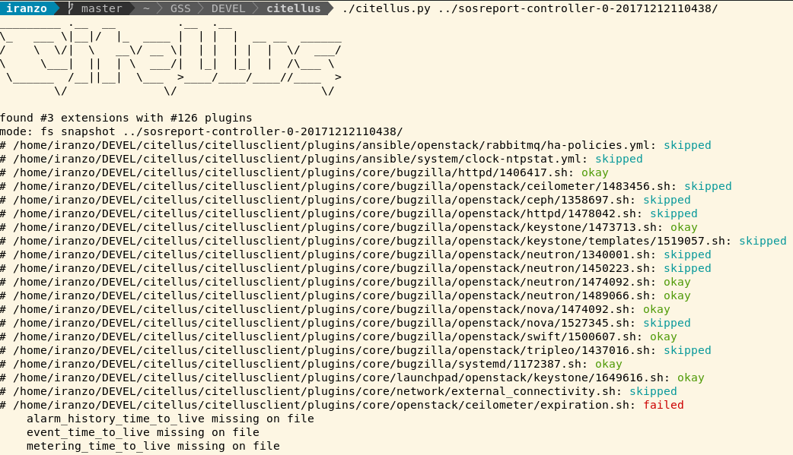

## [Citellus](https://citellus.org):
### Detecting common pitfalls of deployments


<https://citellus.org>

---

## What is Citellus?

- Citellus is a framework populated by community-contributed scripts that automate detecting problems, including configuration issues, conflicts with package versions, and more.

----

## History: how did was it started?

- The tool, was started by [Robin Černín](https://zerodayz.github.io/) after a long weekend shift checking one and over again several sosreports for the same data on different hosts.

- It started with some tests + shell wrapper, and was added a python wrapper by [Pablo Iranzo](https://iranzo.github.io) to bring in more powerful features.

- After some design discussions with Engineering, a simpler reporting and design of tests was implemented.

---

## What can you do with Citellus?

- Run against a sosreport or live environment.
- Solve issues faster thanks to the information it provides.
- Use the community-provided plugins for detecting actual or potential issues.
- Code new plugins in your language of choice (bash, python, ruby, etc.) to extend functionality.
    - Contribute them upstream for others to benefit.
- Use that information as part of proactive insights about the systems.

---

## Real life examples?
- For example, with Citellus you can detect:
    - Failed keystone token purges.
    - missing parameters in expired ceilometer data, which can lead to filling up your hard drive.
    - unsynced ntp.
    - outdated packages that have known critical issues.
    - others! (200+ plugins as of this writting some of them with more than one issue detected)
- Whatever else you can imagine or code 😉

----

## Some numbers on plugin count:

<small>
<small>
- bugzilla : 21 ['docker: 1', 'httpd: 1', 'openstack/ceilometer: 1', 'openstack/ceph: 1', 'openstack/cinder: 1', 'openstack/httpd: 1', 'openstack/keystone: 1', 'openstack/keystone/templates: 1', 'openstack/neutron: 5', 'openstack/nova: 4', 'openstack/swift: 1', 'openstack/tripleo: 2', 'systemd: 1']
- ceph : 3 []
- cluster : 1 []
- docker : 1 []
- httpd : 1 []
- launchpad : 1 ['openstack/keystone: 1']
- negative : 2 ['system: 1', 'system/iscsi: 1']
- network : 2 []
- openshift : 2 ['etcd: 1', 'node: 1']
- openstack : 75 ['ceilometer: 2', 'ceph: 1', 'cinder: 4', 'containers: 4', 'containers/docker: 2', 'containers/rabbitmq: 1', 'crontab: 3', 'glance: 1', 'haproxy: 2', 'hardware: 1', 'iptables: 1', 'keystone: 3', 'mysql: 8', 'network: 4', 'neutron: 4', 'nova: 12', 'openvswitch: 2', 'pacemaker: 1', 'rabbitmq: 5', 'redis: 1', 'swift: 3', 'system: 2', 'systemd: 1']
- pacemaker : 10 []
- positive : 19 ['cluster/cman: 1', 'openstack: 16', 'openstack/ceilometer: 1', 'system: 1']
- security : 12 ['meltdown: 2', 'spectre: 8']
- supportability : 2 []
- system : 60 ['iscsi: 1']
- virtualization : 2 []
-------
total : 215
</small>
</small>

---

## The goal

- Be so damn simple to write new plugins that anyone can do them.
- Write tests in whatever language (bash, python, perl, etc) as long as they conform to some standards.
- Allow anyone to submit new plugins.

---

## How to run it manually?
<!-- .element height="50%"  width="90%" -->


Note: Change speaker after this

---

## Highlights

<small>

- Plugins in your language of choice.
- Allows dumping output to json file to be processed by other tools.
    - Allow the visualization of html from the json output.
- Ansible playbook support (live and snapshot if crafted playbooks)
    - Core implemented as extension to easily expand with new ones.
- Save / restore default settings.
- Run via pip/pipsi if you don't want to git clone from repo or using a container.

</small>

----

## HTML Interface
- Create by using --web, open the generated `citellus.html` over http.
<!-- .element height="50%"  width="70%" -->

---

## Why upstream?

<small>

- This is an open source project. All the scripts should be committed upstream and shared (and we are willing to foster this).
    - Project on GitHub: <https://github.com/citellusorg/citellus/>
- We want contributions from anyone.
- We follow an approach similar to other opensource projects: we use Gerrit for reviewing the code and UT's for validating basic functionality.

</small>

---

## How do I contribute?

<small>

At the moment, there’s a strong presence on OpenStack plugins as it is where we solve our issues on everyday basis, but allows anything, as long as there are tests written for it.

For example, it will be easy to report on systems registered against RHN instead of CDN or systems with a specific version of pacemaker known to have lot of issues or check amount of free memory or memory usage from a process.

Read contributing doc at:  <https://github.com/citellusorg/citellus/blob/master/CONTRIBUTING.md> for more details.

</small>

---

## Citellus vs other tools

- XSOS: Provides information on ram usage, etc, no analysis, more like a ‘fancy’ sosreport viewer.

- TripleO-validations: only runs live from the environment, for customer support most of times we cannot afford to do that.

---

## Why not sosreports?

<small>

- It’s not Citellus or ‘sosreports’, SOS collects data from the system, Citellus, runs tests/plugins against the data collected.
- Sosreport is installed in RHEL base channels, this makes it well spread, but also, slower to get changes.
- Frequently, data about errors or errors to be, is already in sosreports.
- Citellus is based on known issues and easy to extend with new ones, requires faster devel cycle, targeting more a devops or support teams as target audience.

</small>


Note: Change speaker after this

---

## How does it work under the hood?

Philosophy is very simple:
- Citellus is just a simple wrapper.
- Allows to specify on sosreport and test filters.
- Finds tests available in test folders.
- Executes each test against sosreport and reports return status.
- Framework written in python which features option parsing, parallel execution of tests, filtering, etc.

---

## What about the plugins?

Tests are even simpler:

- Written in whatever language as long as they can be executed from shell
- Output messages to ‘stderr’ (>&2)
- When using strings like echo $”string” bash’s built-in i18n is used so you can translate to your language
- Return `$RC_OKAY` for success / `$RC_FAILED` for error / `$RC_SKIPPED` for skipped tests / Other for unexpected error.

----

## What about the plugins? (continuation)

- Will inherit some env vars like root folder for sosreport (empty for live) (`CITELLUS_ROOT`) or if running live (`CITELLUS_LIVE`) that provide required details. No user input should be required.
- Live tests can, for example, query DB and ones in sosreport check values on logs.

----

## Some execution and script examples?

Check [disk usage](<https://github.com/citellusorg/citellus/blob/master/citellus/plugins/system/disk_usage.sh>):

```sh
#!/bin/bash

# Load common functions
[ -f "${CITELLUS_BASE}/common-functions.sh" ] && . "${CITELLUS_BASE}/common-functions.sh"

# description: error if disk usage is greater than $CITELLUS_DISK_MAX_PERCENT
: ${CITELLUS_DISK_MAX_PERCENT=75}

if [[ $CITELLUS_LIVE = 0 ]]; then
    is_required_file "${CITELLUS_ROOT}/df"
    DISK_USE_CMD="cat ${CITELLUS_ROOT}/df"
else
    DISK_USE_CMD="df -P"
fi

result=$($DISK_USE_CMD |awk -vdisk_max_percent=$CITELLUS_DISK_MAX_PERCENT '/^\/dev/ && substr($5, 0, length($5)-1) > disk_max_percent { print $6,$5 }')

if [ -n "$result" ]; then
    echo "${result}" >&2
    exit $RC_FAILED
else
    exit $RC_OKAY
fi
```

---

## Ready for deep dive on tests?

- Each test should take care of checking if it should run or not and output return code and stderr. Wrapper just runs all the tests or specific ones (filtering options).

---

## Requirements:
- return code must be `$RC_OKAY` (ok), `$RC_FAILED` (failed)  or `$RC_SKIPPED` (skipped).
- Messages to be printed on stderr are displayed on 'failed' or 'skipped' if verbose enabled.
- Running against ‘sosreport’, `CITELLUS_ROOT` contains path to sosreport folder provided.
- `CITELLUS_LIVE` contains `0` or `1` if running against live or not.

----

## How to start a new plugin (example)
- Write a script in `~/~/.../plugins/core/rhev/hosted-engine.sh`
- `chmod +x hosted-engine.sh`

----

## How to start a new plugin (continuation)

~~~sh
if [ “$CITELLUS_LIVE” = “0” ]; then
    grep -q ovirt-hosted-engine-ha $CITELLUS_ROOT/installed-rpms
    returncode=$?
    if [ “x$returncode” == “x0” ]; then
        exit $RC_OKAY
    else
        echo “ovirt-hosted-engine is not installed “ >&2
        exit $RC_FAILED
    fi
else
    echo “Not running on Live system” >&2
    exit $RC_SKIPPED
fi
~~~

----

## How to start a new plugin (with functions)

~~~sh
# Load common functions
[ -f "${CITELLUS_BASE}/common-functions.sh" ] && . "${CITELLUS_BASE}/common-functions.sh"

if is_rpm ovirt-hosted-engine-ha; then
    exit $RC_OKAY
else
    echo “ovirt-hosted-engine is not installed “ >&2
    exit $RC_FAILED
fi
~~~

----

## How to test your plugin?

- Use `tox` to run some UT's (utf8, bashate, python 2.7, python 3.5)

- Specify the plugin to use:
~~~sh
[piranzo@host citellus]$ ~/citellus/citellus.py sosreport-20170724-175510/crta02 -i hosted-engine.sh
_________ .__  __         .__  .__
\_   ___ \|__|/  |_  ____ |  | |  |  __ __  ______
/    \  \/|  \   __\/ __ \|  | |  | |  |  \/  ___/
\     \___|  ||  | \  ___/|  |_|  |_|  |  /\___ \
 \______  /__||__|  \___  >____/____/____//____  >
        \/              \/                     \/
mode: fs snapshot sosreport-20170724-175510/crta02
# ~/~/.../plugins/core/rhev/hosted-engine.sh: failed
    “ovirt-hosted-engine is not installed “
~~~

---

## What is Magui
### Introduction
- Citellus works on individual sosreports against a set of tests (all by default), but some problems require checks across several systems.

<small>For example, galera requires to check seqno across all controllers running database.</small>

---

### What does M.a.g.u.i. do?
- It runs citellus against each sosreport, gathers and groups the data per plugin.
- Runs its own plugins against the data received to highlight issues that depend on several systems.
- Allows grabbing remote host data via ansible host lists.

----

## How does it looks like?

<small>

It’s delivered in citellus repo and can be executed by specifying sosreports:
~~~sh
[piranzo@collab-shell]$ ~/citellus/magui.py * -i seqno
    _
  _( )_  Magui:
 (_(ø)_)
  /(_)   Multiple Analisis Generic Unifier and Interpreter
 \|
  |/
{'~/~/.../core/openstack/mysql/seqno.sh': {'controller0': {'err': u'2b65adb0-787e-11e7-81a8-26480628c14c:285019879\n',
                                                                'out': u'',
                                                                'rc': 10},
                                                'controller1': {'err': u'2b65adb0-787e-11e7-81a8-26480628c14c:285019879\n',
                                                                'out': u'',
                                                                'rc': 10},
                                                'controller2': {'err': u'2b65adb0-787e-11e7-81a8-26480628c14c:285019878\n',
                                                                'out': u'',
                                                                'rc': 10}}}
~~~

- In this example, UUID and SEQNO is shown for each controller and we can see that controller 2 has different SEQNO from the other two nodes.

</small>

----

## Next steps with Magui

- Some plugins as of this writing:
    - Aggregate data from citellus sorted by plugin for quick comparison
    - Show 'metadata' extension separated to quickly compare across values
    - pipeline-yaml different across sosreports
    - seqno and highest seqno in galera
    - release check across hosts

---

## Action Items

- Add more plugins!
- Evangelize about the tool so we can work together in solving our common issues on the same framework.
- Get moving fast enough that the tool has continuity, other tools just died by having a ‘solo’ developer working in their spare time.
- Start implementing more tests in Magui that provide real intelligence (for example we do report and check on seqno or pipeline-yaml but lot of other issues can benefit from this).

---

## Other resources
Blog posts:
<small>

- Citellus tagged posts: https://iranzo.github.io/blog/tag/citellus/
- <http://iranzo.github.io/blog/2017/07/26/Citellus-framework-for-detecting-known-issues/>
- <https://iranzo.github.io/blog/2017/07/31/Magui-for-analysis-of-issues-across-several-hosts/>
- <https://iranzo.github.io/blog/2017/08/17/Jenkins-for-running-CI-tests/>
- <https://iranzo.github.io/blog/2017/10/26/i18n-and-bash8-in-bash/>
- <https://iranzo.github.io/blog/2018/01/16/recent-changes-in-magui-and-citellus/>
- DevConf.cz 2018 recording <https://www.youtube.com/watch?v=SDzzqrUdn5A>

</small>

---

## Questions?

THANK YOU FOR ATTENDING!!

For additional questions, come to #citellus on Freenode or email us:

- https://citellus.org
- citellus-dev _AT_ redhat.com
- <https://www.redhat.com/mailman/listinfo/citellus-dev>

----

### Quiz 1/4!!

<small>

1. What sort of logic are scripts using to determine if the check is failed/ok or should be skipped

    - Exit status for commands like `grep`, etc
    - Check requirements to run, target environment and matching details
    - bash conditionals
    - custom functions checks

</small>

Note:

<small>

1. Skipped: no requirements satisfied, ok: no problem detected, Fail: test is failed (2)


</small>

----

### Quiz 2/4!!

<small>

1. What do I need to do if I want to add my scripts

    - Modify citellus.py to define new path
    - Use include filter to add it
    - chmod +x the script in the plugins folder
    - Append path to the script after sosreport

</small>

Note:

<small>

1. Create a new script, chmod +x and return valid status code (3)

</small>

----

### Quiz 3/4!!

<small>

1. What languages are supported for scripts?

    - bash, python, ruby
    - python, bash, c++
    - golang, perl
    - all of above

</small>

Note:

1. All of above

----

### Quiz 4/4!!

<small>

1. What are the valid return status for scripts?

    - RC_WARNING
    - RC_OKAY
    - RC_SKIPPED
    - RC_FAILED

</small>

Note:

1. RC_OKAY, RC_SKIPPED, RC_FAILED
